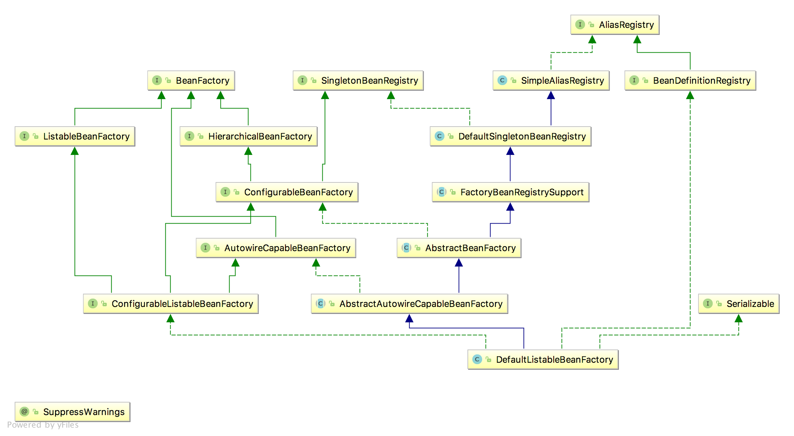

### 教程信息
**题外话**：Spring 技术系列干货整理 [https://mp.weixin.qq.com/s/N507Cfb_mbkGvHtg_FIaVg](https://mp.weixin.qq.com/s/N507Cfb_mbkGvHtg_FIaVg)

**源码地址**：[https://github.com/spring-projects/spring-framework](https://github.com/spring-projects/spring-framework)  

**准备工作**：gradle环境，IDE，本笔记使用idea工具进行操作。
下载完成后，项目根目录下有个import-into-eclipse.md文件，打开，按照说明进行编译。

#### 3.1 constructor-arg

 类的构造函数会全部进行实例化。参见`ConstructorArgJunitTest`测试类
 
 ApplicationContext的初始化和BeanFactory有一个重大的区别：BeanFactory在初始化容器时，并未实例化Bean，直到第一次访问某个Bean时才实例目标Bean；而ApplicationContext则在初始化应用上下文时就实例化所有单实例的Bean。因此ApplicationContext的初始化时间会比BeanFactory稍长一些，不过稍后的调用则没有"第一次惩罚"的问题。
 
 **ClassPathResource** : spring配置文件读取类
 
 spring profile 多环境配置管理
 
 https://www.cnblogs.com/pangguoming/p/5888871.html
  
 
 在`SimpleAliasRegistry `类中，`allowAliasOverriding()`方法，默认返回true。实际在`DefaultListableBeanFactory`中有覆写操作。详细代码如下：
 
 ```java
	 public class SimpleAliasRegistry implements AliasRegistry {
	
		/** Map from alias to canonical name */
		private final Map<String, String> aliasMap = new ConcurrentHashMap<String, String>(16);
	
	
		public void registerAlias(String name, String alias) {
			Assert.hasText(name, "'name' must not be empty");
			Assert.hasText(alias, "'alias' must not be empty");
			if (alias.equals(name)) {
				this.aliasMap.remove(alias);
			}
			else {
				if (!allowAliasOverriding()) {
					String registeredName = this.aliasMap.get(alias);
					if (registeredName != null && !registeredName.equals(name)) {
						throw new IllegalStateException("Cannot register alias '" + alias + "' for name '" +
								name + "': It is already registered for name '" + registeredName + "'.");
					}
				}
				checkForAliasCircle(name, alias);
				this.aliasMap.put(alias, name);
			}
		}
	
		/**
		 * Return whether alias overriding is allowed.
		 * Default is {@code true}.
		 */
		protected boolean allowAliasOverriding() {
			return true;
		}
	。。。
}
 ```
 
 ```java
 public class DefaultListableBeanFactory extends AbstractAutowireCapableBeanFactory
		implements ConfigurableListableBeanFactory, BeanDefinitionRegistry, Serializable {
		...
		...
		...
		/** Whether to allow re-registration of a different definition with the same name */
	private boolean allowBeanDefinitionOverriding = true;
		...
		...
	/**
	 * Set whether it should be allowed to override bean definitions by registering
	 * a different definition with the same name, automatically replacing the former.
	 * If not, an exception will be thrown. This also applies to overriding aliases.
	 * <p>Default is "true".
	 * @see #registerBeanDefinition
	 */
	public void setAllowBeanDefinitionOverriding(boolean allowBeanDefinitionOverriding) {
		this.allowBeanDefinitionOverriding = allowBeanDefinitionOverriding;
	}
	...
	...
	@Override
	public void copyConfigurationFrom(ConfigurableBeanFactory otherFactory) {
		super.copyConfigurationFrom(otherFactory);
		if (otherFactory instanceof DefaultListableBeanFactory) {
			DefaultListableBeanFactory otherListableFactory = (DefaultListableBeanFactory) otherFactory;
			//此处也包含设置值的信息
			this.allowBeanDefinitionOverriding = otherListableFactory.allowBeanDefinitionOverriding;
			this.allowEagerClassLoading = otherListableFactory.allowEagerClassLoading;
			this.autowireCandidateResolver = otherListableFactory.autowireCandidateResolver;
			this.resolvableDependencies.putAll(otherListableFactory.resolvableDependencies);
		}
	}
	...
	...
	/**
	 * 此处进行了覆写操作
	 * Only allows alias overriding if bean definition overriding is allowed.
	 */
	@Override
	protected boolean allowAliasOverriding() {
		return this.allowBeanDefinitionOverriding;
	}
	。。。
 }
 ```
 两者关系图如下

 
#### 4.1 自定义标签使用
扩展spring自定义标签配置大致需要以下几个步骤(前提是要把spring的core包加入项目中)

  * 创建一个需要扩展的组件
  * 定义一个XSD文件描述组件内容
  * 创建一个文件，实现BeanDefinitionParser接口，用来解析XSD文件中的定义和组件容器。
  * 编写Spring.handlers和Spring.schemas文件。
  
自定义标签的XSD文件中，elementFormDefault属性讲解参考：
[http://note.youdao.com/noteshare?id=ed3e7a6a1edcd5521a6bd72a36296295](http://note.youdao.com/noteshare?id=ed3e7a6a1edcd5521a6bd72a36296295)

自定义标签示例参考：[https://blog.csdn.net/shinebar/article/details/75675615](https://blog.csdn.net/shinebar/article/details/75675615)

##### 配置注意

* `xsdDefineMarkTest.xsd`组件内容描述文件中，`targetNamespace`指定了对象名称空间，对应`xsdDefineMarkTest.xml`文件中xmlns:myname的地址
* xsdDefineMarkTest.xml文件中`xmlns:myname` 对应实际的bean信息 <font color=blue> **\<myname:userxsd** </font> id="userXsdBean" email="aaa" userName="zhangsan"/>
* 需要创建的META-INF文件夹在resources(即classpath路径下)。spring.handlers和spring.schemas文件中，冒号需要进行转义
* 根据自定义，创建的相关文件信息如下：

`xsdDefineMarkTest.xml`

```xml
	<?xml version="1.0" encoding="UTF-8"?>
	<beans xmlns="http://www.springframework.org/schema/beans"
	       xmlns:xsi="http://www.w3.org/2001/XMLSchema-instance"
	       xmlns:myname="http://www.codejiayou.com/schema/user"
	       xsi:schemaLocation="http://www.springframework.org/schema/beans
	       http://www.springframework.org/schema/beans/spring-beans.xsd
	       
	       http://www.codejiayou.com/schema/user 
	       http://www.codejiayou.com/schema/user.xsd
	">
	<!--beans 中的http://www.codejiayou.com/schema/user 
	http://www.codejiayou.com/schema/user.xsd两个地址分别对应spring.handlers和spring.schemas中的地址名称-->
	<!--myname与beans中的xmlns:myname的myname相对应，userxsd与MyNamespaceHandler类中的elementName相对应-->
	   <myname:userxsd id="userXsdBean" email="aaa" userName="zhangsan"/>
	
	</beans>

```
`xsdDefineMarkTest.xsd`

```xml
<?xml version="1.0" encoding="UTF-8"?>
<!--targetNamespace信息为随机填写-->
<schema xmlns="http://www.w3.org/2001/XMLSchema"
        targetNamespace="http://www.codejiayou.com/schema/user"
        xmlns:tns="http://www.codejiayou.com/schema/user"
        elementFormDefault="qualified">

    <element name="userxsd">
    <complexType>
        <attribute name="id" type="string"/>
        <attribute name="userName" type="string"/>
        <attribute name="email" type="string"/>
    </complexType>
    </element>


</schema>
```

`spring.handlers`

```java
http\://www.codejiayou.com/schema/user=com.spring.source.code.beans.ch4.beanparser.MyNamespaceHandler
```

`spring.schemas`

```
#冒号需要进行转义
http\://www.codejiayou.com/schema/user.xsd=ch4/xsdDefineMarkTest.xsd
```

`MyNamespaceHandler.java`

```java
package com.spring.source.code.beans.ch4.beanparser;

import org.springframework.beans.factory.xml.NamespaceHandlerSupport;

/**
 * 当遇到自定义标签<user:aaa 这样类似于以user开头的元素，就会把这个元素扔给对应的UserBeanDefinitionParser去解析。
 *
 * @author yuijnshui
 * @Title: MyNamespaceHandler
 * @Copyright: Copyright (c) 2017
 * @Description: <br>
 * @Company: www.qdingnet.com
 * @Created on 2018/8/6下午8:13
 */
public class MyNamespaceHandler extends NamespaceHandlerSupport {
    @Override
    public void init() {
        //userxsd与xsdDefineMarkTest.xml配置中的<myname:userxsd的userxsd相对应，否则无法正常解析
        registerBeanDefinitionParser("userxsd", new UserBeanDefinitionParser());
    }
}

```

`UserBeanDefinitionParser.java`

```java
package com.spring.source.code.beans.ch4.beanparser;

import com.spring.source.code.beans.ch4.UserXsd;
import org.springframework.beans.factory.support.BeanDefinitionBuilder;
import org.springframework.beans.factory.xml.AbstractSingleBeanDefinitionParser;
import org.springframework.util.StringUtils;
import org.w3c.dom.Element;

/**
 * 解析xsd文件的定义和组件的定义
 * @author yuijnshui
 * @Title: UserBeanDefinitionParser
 * @Copyright: Copyright (c) 2017
 * @Description: <br>
 * @Company: www.qdingnet.com
 * @Created on 2018/8/6下午8:03
 */
public class UserBeanDefinitionParser extends AbstractSingleBeanDefinitionParser {


    /**
     * element对应的类
     * @author code
     * @date 2018/8/6 下午8:07
     * @param element
     * @return java.lang.Class
     */
    protected Class getBeanClass(Element element){
        return UserXsd.class;
    }

    /**
     * 从element中解析并提取对应的元素
     * @author code
     * @date 2018/8/6 下午8:08
     * @param element
    * @param builder
     * @return void
     */
    protected void doParse(Element element, BeanDefinitionBuilder builder){

        String userName = element.getAttribute("userName");
        String email = element.getAttribute("email");

        //将提取的数据放入BeanDefinitionBuilder中，待到完成所有bean的解析后统一注册到beanFactory中
        if (StringUtils.hasText(userName)){
            builder.addPropertyValue("userName",userName);
        }
        if (StringUtils.hasText(userName)){
            builder.addPropertyValue("email",email);
        }

    }
}

```

`UserXsd.java`

```java
package com.spring.source.code.beans.ch4;

/**
 * 自定义标签的使用bean
 *
 * @author yuijnshui
 * @Title: UserXsd
 * @Copyright: Copyright (c) 2017
 * @Description: <br>
 * @Company: www.qdingnet.com
 * @Created on 2018/8/6下午4:13
 */
public class UserXsd {

    private String userName;
    private String email;

    public String getUserName() {
        return userName;
    }

    public UserXsd setUserName(String userName) {
        this.userName = userName;
        return this;
    }

    public String getEmail() {
        return email;
    }

    public UserXsd setEmail(String email) {
        this.email = email;
        return this;
    }
}


```

#### 5.1 FactoryBean的使用
个人体会：可以用于进行一些字典数据的初始化操作使用。

* **为什么要有FactoryBean接口？**

 一般情况下，Spring 通过反射机制利用bean的class属性指定实现类来实例化bean。在某些情况下，实例化bean过程比较复杂，如果按照传统的方式，则需要在<bean>中提供大量的配置信息，配置方式的灵活性是受限的，这时采用编码的方式可能会得到一个简单的方案。Spring为此提供了一个 org.Springframework.bean.factory.FactoryBean 的工厂类接口，用户可以通过实现该接口定制实例化bean的逻辑。

* **demo参考**

 获取自定义bean的实例，使用`getBean("beanName")`，获取该bean的`FactoryBean`实例，只需在`beanName`前加个` &`前缀即可。参见 `CarFactoryBeanTest.java`，`BeanFactoryTest.testSimpleLoad_special()`
 
* **网络资料**
<pre>
 <div class="postBody">
			<div id="cnblogs_post_body" class="blogpost-body"><p><span style="font-size: 14pt;">1.BeanFactory提供的是<strong><span style="color: #ff0000;">最基本</span></strong>的<strong><span style="color: #ff0000;">IoC容器的功能</span></strong>，关于这些<strong><span style="color: #ff0000;">功能定义</span></strong>，我们可以在<strong><span style="color: #ff0000;">接口BeanFatory中看到</span></strong>。</span></p>
<p><span style="font-size: 14pt;">2.BeanFactory接口定义了<strong><span style="color: #ff9900;">IoC容器</span><em><span style="color: #99cc00;">最基本的容器的形式</span></em></strong>，并且提供了<strong><span style="color: #ff9900;">IoC容器所应该遵守</span></strong>的<em><strong><span style="color: #99cc00;">最基本的服务契约</span></strong></em>，同时，这也是我们<strong><span style="color: #ff9900;">使用IoC容器</span><span style="color: #ff0000;">所应遵守的</span><em><span style="color: #99cc00;">最底层</span></em></strong>和<em><strong><span style="color: #99cc00;">最基本</span></strong></em>的<em><strong><span style="color: #99cc00;">编程规范</span></strong></em>，这些接口定义勾画出了<strong><span style="color: #99cc00;">IoC的基本轮廓</span></strong>。</span></p>
<p><span style="font-size: 14pt;">3.很显然，在Spring的代码实现中，BeanFactory<strong><span style="color: #339966;">只是一个接口类</span></strong>，并<strong><span style="color: #339966;">没有给出</span><em><span style="color: #33cccc;">容器的具体实现</span></em></strong>，而我们在图中看到的各种具体类，比如DefaultListableBeanFactory、XmlBeanFactory、ApplicationContext等<strong><span style="color: #33cccc;">都可以看成</span></strong>是<strong><span style="color: #33cccc;">容器附加了某种功能</span></strong>的<strong><span style="color: #33cccc;">具体实现</span></strong>，也就是<strong><span style="color: #339966;">容器体系</span></strong>中的<strong><span style="color: #339966;">具体容器产品</span></strong>。</span></p>
<h1><span style="font-size: 18pt; line-height: 28px;"><strong>下面我们来看看BeanFactory是怎样定义IoC容器的基本接口的</strong></span></h1>
<p><span style="font-size: 19px; line-height: 28px;">1.用户使用容器时，可以<strong><span style="color: #ff0000;">使用转义符"&amp;"</span></strong>来得到<strong><span style="color: #ff0000;">FactoryBean本身</span></strong>，<strong><span style="color: #ff0000;">用来区分</span><span style="color: #ff9900;"><em>通过容器来获取FactoryBean产生的对象</em></span></strong>和<em><strong><span style="color: #ff9900;">获取FactoryBean本身</span></strong></em>。</span></p>
<p><span style="font-size: 19px; line-height: 28px;">2.举例来说，如果<strong><span style="color: #ff0000;">myJndiObject</span></strong>是一个FactoryBean，那么使用<strong><span style="color: #ffcc00;">&amp;myJndiObject</span></strong>得到的是FactroyBean，<em><strong><span style="color: #ffcc00;">而不是myJndiObject这个FactoryBean产生出来的对象</span></strong></em>。</span></p>
<p><span style="font-size: 19px; line-height: 28px;">3.关于具体的<strong><span style="color: #ff0000;">FactoryBean</span></strong>的<strong><span style="color: #ff0000;">设计</span></strong>和<strong><span style="color: #ff0000;">实现模式</span></strong>，我们会在<strong><span style="color: #ff0000;">后面的章节中介绍</span></strong>。</span></p>
<p><span style="font-size: 19px; line-height: 28px;">4.<span style="font-size: 14pt;">注意，理解上面这段话需要很好地区分<strong><span style="color: #ff00ff;">FactoryBean</span></strong>和<strong><span style="color: #ffcc00;">BeanFactory</span></strong>这两个在<span style="color: #00ccff;"><strong>Spring中使用频率很高的类</strong></span>，它们在拼写上非常相似。</span></span></p>
<p><span style="font-size: 19px; line-height: 28px;"><span style="font-size: 14pt;">5.<em><strong><span style="color: #993366;">一个是Factory，也就是IoC容器或对象工厂</span></strong></em>；<em><strong><span style="color: #cc99ff;">一个是Bean</span></strong></em>。</span></span></p>
<p><span style="font-size: 19px; line-height: 28px;"><span style="font-size: 14pt;">6.在Spring中，所有的Bean都是由BeanFactory（也就是IoC容器）来进行管理的。</span></span></p>
<p><span style="font-size: 19px; line-height: 28px;"><span style="font-size: 14pt;">7.但对FactoryBean而言，这个Bean不是简单的Bean，<strong><span style="color: #ff99cc;">而是</span></strong>一个<strong><span style="color: #ff99cc;">能产生</span></strong>或者<strong><span style="color: #ff99cc;">修饰对象生成</span></strong>的<strong><span style="color: #ff99cc;">工厂Bean</span></strong>，它的<strong><span style="color: #339966;">实现</span></strong>与设计模式中的<strong><span style="color: #339966;">工厂模式</span></strong>和<strong><span style="color: #339966;">修饰器</span></strong>类似。</span></span></p></div><div id="MySignature"></div>
</pre>

* **看看编程方式使用IoC容器**
 1. 参考XmlBeanFactory的实现，我们以编程的方式使用DefaultListableBeanFactory。从中我们可以看到IoC容器使用的一些基本过程。

 2. 尽管我们在应用中使用IoC容器时很少会使用这样原始的方式，但是了解一下这个基本过程，对我们了解IoC容器的工作原理是非常有帮助的。

 3. 因为这个`编程式使用容器`的过程，很清楚揭示了在`IoC容器`实现中的那些`关键的类`(比如Resource、DefaultListableBeanFatory和BeanDefinitionReader)之间的`相互关系`，例如它们是如何把`IoC容器的功能解耦`的，又是如何结合在一起为IoC容器服务的，等等。
 
   ```java
   ClassPathResource res = new ClassPathResource("beans.xml");
   DefaultListableBeanFactory factory = new DefaultListableBeanFactory();
   XmlBeanDefinitionReader reader = new XmlBeanDefinitionReader(factory);
   reader.loadBeanDefinition(res);
   ```

 这样我们就可以通过factory对象来使用DefaultListableBeanFactory这个IoC容器了。

 在使用IoC容器时，需要如下几个步骤：

 1. 创建`IoC配置文件`的`抽象资源`，这个`抽象资源`包含了`BeanDefinition的定义信息`。
 2. 创建一个`BeanFactory`，这里使用DefaultListableBeanFactory。
 3. 创建一个`载入BeanDefinition的读取器`，这里使用XmlBeanDefinitionReader来载入XML文件形式的BeanDefinition，通过一个`回调配置给BeanFactory`。
 4. 从定义好的`资源位置`读入配置信息，具体的解析过程由XmlBeanDefinitionReader来完成。完成整个载入和注册Bean定义之后，需要的IoC容器就建立起来了。这个时候就可以直接使用IoC容器了。

#### 5.5 准备创建bean
> 我们不可能指望在一个函数中完成一个复杂的逻辑，而且我们跟踪了这么多Spring代码，经历了这么多函数，或多或少也发现了一些规律：`一个真正千活的函数其实是以do开头`的，比如`doGetObjectFromFactoryBean`；而给我们错觉的函数，比如`getObjectFromFactoryBean`，其实只是从全局角度去做些统筹的工作。

#### 5.6.2 Spring如何解决循环依赖
在Spring中将循环依赖的处理分成了3种情况。

1.  __构造器循环依赖__
  
  - 表示通过构造器注人构成的循环依赖，此依赖是无法解决的，只能抛出BeanCurrentlyInCreationException异常表示循环依赖。
  - 如在创建TestA类时，构造器需要TestB类，那将去创建TestB,在创建TestB类时又发现需要TestC类，则又去创建TestC,最终在创建TestC时发现又需要TestA,从而形成一个环,没办法创建。
  - Spring容器将每一个正在创建的bean标识符放在一个“当前创建bean池”中，bean标识符在创建过程中将一直保持在这个池中，因此如果在创建bean过程中发现自己已经在“当前创建bean池”里时，将抛出BeanCurrentlyInCreationException异常表示循环依赖;而对于创建完毕的bean将从“当前创建bean池”中清除掉。
  - 参见测试类`CircleDependencyBeanTest.java`
 
 ```
 针对以上测试代码的分析如下。
Spring容器创建“testA”bean，首先去“当前创建bean池”查找是否当前bean正在创建，如果没发现，则继续准备其需要的构造器参数“testB”， 并将“testA” 标识符放到“当前创建bean池”。
Spring容器创建“testB”bean,首先去“当前创建bean池”查找是否当前bean正在创建，如果没发现，则继续准备其需要的构造器参数“testC” ,并将“testB” 标识符放到“当前创建bean池”。
Spring容器创建“testC”bean,首先去“当前创建bean池”查找是否当前bean正在创建，如果没发现，则继续准备其需要的构造器参数“testA”， 并将“testC” 标识符放到“当前创建Bean池”。
到此为止Spring容器要去创建“testA” bean， 发现该bean 标识符在“当前创建bean池”中，因为表示循环依赖，抛出BeanCurrentlyInCreationException.
 ```
 
2. **setter循环依赖**

 表示通过setter, 注人方式构成的循环依赖。对于setter注人造成的依赖是通过Spring容器提前暴露刚完成构造器注人但未完成其他步骤(如setter 注人)的bean来完成的，而且只能解决单例作用域的bean循环依赖。通过提前暴露一个 单例工厂方法，从而使其他bean能引用到该bean，如下代码所示：
 
 ```java
   addSingletonFactory(beanName, new ObjectFactory(){
 	public Object getObject() throws BeanException{
 		return getEarlyBeanReference(beanName, mbd, bean);
	 }
 });
 ```
 
3. **prototype范围的依赖处理**

 对于“prototype”作用域bean，Spring容器无法完成依赖注入，因为Spring容器不进行缓存“prototype”作用域的bean，因此无法提前暴露一个创建中的bean。示例如下：
 
 ```java
 
 ```
 spring 循环引用的处理参考学习地址：[https://www.iflym.com/index.php/code/201208280001.html](https://www.iflym.com/index.php/code/201208280001.html)
 
 
 
## 零散笔记

#### aop切面日志重复执行问题

 当使用了注解方式配置切面日志时，`不需要`在配置文件中重新配置bean信息，只需要添加
`<aop:aspectj-autoproxy proxy-target-class="true"/>`
注解即可。

示例如下

* 配置文件中配置：

 ```xml
 <aop:aspectj-autoproxy proxy-target-class="true"/>
<!--<bean class="com.qding.payment.service.log.TracerLogAspect" />去掉该配置-->
 ```
* java类的配置
 
 ```java
 @Aspect
 @Component
 public class TracerLogAspect extends LogAspect {
    @Around("execution(* com.qding.payment.service..*.*(..))")
    @Override
    public Object doAround(ProceedingJoinPoint joinPoint) throws Throwable {
...........
            LogPortal.info("执行时间:" + (end - start) + "ms,执行类名:" + joinPoint.getTarget().getClass().getName()
                    + ",执行方法:" + method.getName() + ",传入参数:" + sb.toString() + ",返回数据:" + (obj == null ? null : obj.toString()));
        return obj;
    }
}
 ```
