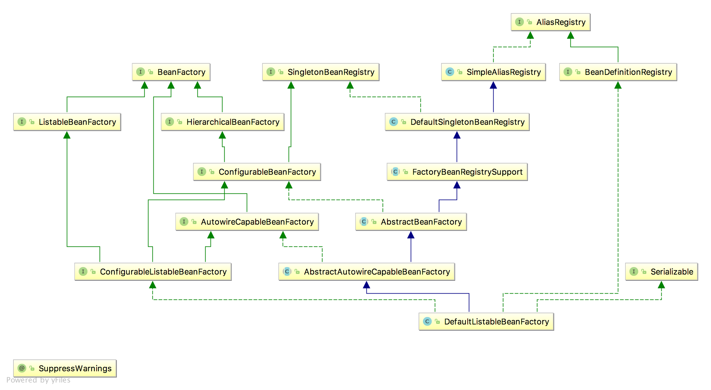

### 教程信息

**源码地址**：[https://github.com/spring-projects/spring-framework](https://github.com/spring-projects/spring-framework)  
**准备工作**：gradle环境，IDE，本笔记使用idea工具进行操作。
下载完成后，项目根目录下有个import-into-eclipse.md文件，打开，按照说明进行编译。

#### 3.1 constructor-arg

 类的构造函数会全部进行实例化。参见`ConstructorArgJunitTest`测试类
 
 ApplicationContext的初始化和BeanFactory有一个重大的区别：BeanFactory在初始化容器时，并未实例化Bean，直到第一次访问某个Bean时才实例目标Bean；而ApplicationContext则在初始化应用上下文时就实例化所有单实例的Bean。因此ApplicationContext的初始化时间会比BeanFactory稍长一些，不过稍后的调用则没有"第一次惩罚"的问题。
 
 **ClassPathResource** : spring配置文件读取类
 
 spring profile 多环境配置管理
 [https://www.cnblogs.com/pangguoming/p/5888871.html](https://www.cnblogs.com/pangguoming/p/5888871.html)
 
 在`SimpleAliasRegistry `类中，`allowAliasOverriding()`方法，默认返回true。实际在`DefaultListableBeanFactory`中有覆写操作。详细代码如下：
 
 ```java
	 public class SimpleAliasRegistry implements AliasRegistry {
	
		/** Map from alias to canonical name */
		private final Map<String, String> aliasMap = new ConcurrentHashMap<String, String>(16);
	
	
		public void registerAlias(String name, String alias) {
			Assert.hasText(name, "'name' must not be empty");
			Assert.hasText(alias, "'alias' must not be empty");
			if (alias.equals(name)) {
				this.aliasMap.remove(alias);
			}
			else {
				if (!allowAliasOverriding()) {
					String registeredName = this.aliasMap.get(alias);
					if (registeredName != null && !registeredName.equals(name)) {
						throw new IllegalStateException("Cannot register alias '" + alias + "' for name '" +
								name + "': It is already registered for name '" + registeredName + "'.");
					}
				}
				checkForAliasCircle(name, alias);
				this.aliasMap.put(alias, name);
			}
		}
	
		/**
		 * Return whether alias overriding is allowed.
		 * Default is {@code true}.
		 */
		protected boolean allowAliasOverriding() {
			return true;
		}
	。。。
}
 ```
 
 ```java
 ublic class DefaultListableBeanFactory extends AbstractAutowireCapableBeanFactory
		implements ConfigurableListableBeanFactory, BeanDefinitionRegistry, Serializable {
		...
		...
		...
		/** Whether to allow re-registration of a different definition with the same name */
	private boolean allowBeanDefinitionOverriding = true;
		...
		...
	/**
	 * Set whether it should be allowed to override bean definitions by registering
	 * a different definition with the same name, automatically replacing the former.
	 * If not, an exception will be thrown. This also applies to overriding aliases.
	 * <p>Default is "true".
	 * @see #registerBeanDefinition
	 */
	public void setAllowBeanDefinitionOverriding(boolean allowBeanDefinitionOverriding) {
		this.allowBeanDefinitionOverriding = allowBeanDefinitionOverriding;
	}
	...
	...
	@Override
	public void copyConfigurationFrom(ConfigurableBeanFactory otherFactory) {
		super.copyConfigurationFrom(otherFactory);
		if (otherFactory instanceof DefaultListableBeanFactory) {
			DefaultListableBeanFactory otherListableFactory = (DefaultListableBeanFactory) otherFactory;
			//此处也包含设置值的信息
			this.allowBeanDefinitionOverriding = otherListableFactory.allowBeanDefinitionOverriding;
			this.allowEagerClassLoading = otherListableFactory.allowEagerClassLoading;
			this.autowireCandidateResolver = otherListableFactory.autowireCandidateResolver;
			this.resolvableDependencies.putAll(otherListableFactory.resolvableDependencies);
		}
	}
	...
	...
	/**
	 * 此处进行了覆写操作
	 * Only allows alias overriding if bean definition overriding is allowed.
	 */
	@Override
	protected boolean allowAliasOverriding() {
		return this.allowBeanDefinitionOverriding;
	}
	。。。
 }
 ```
 两者关系图如下
 
 
#### 4.1 自定义标签使用
扩展spring自定义标签配置大致需要以下几个步骤(前提是要把spring的core包加入项目中)

  * 创建一个需要扩展的组件
  * 定义一个XSD文件描述组件内容
  * 创建一个文件，实现BeanDefinitionParser接口，用来解析XSD文件中的定义和组件容器。
  * 编写Spring.handlers和Spring.schemas文件。
  
自定义标签的XSD文件中，elementFormDefault属性讲解参考：
[http://note.youdao.com/noteshare?id=ed3e7a6a1edcd5521a6bd72a36296295](http://note.youdao.com/noteshare?id=ed3e7a6a1edcd5521a6bd72a36296295)

自定义标签示例参考：[https://blog.csdn.net/shinebar/article/details/75675615](https://blog.csdn.net/shinebar/article/details/75675615)

##### 配置注意

* `xsdDefineMarkTest.xsd`组件内容描述文件中，`targetNamespace`指定了对象名称空间，对应`xsdDefineMarkTest.xml`文件中xmlns:myname的地址
* xsdDefineMarkTest.xml文件中`xmlns:myname` 对应实际的bean信息 <font color=blue> **\<myname:userxsd** </font> id="userXsdBean" email="aaa" userName="zhangsan"/>
* 需要创建的META-INF文件夹在resources(即classpath路径下)。spring.handlers和spring.schemas文件中，冒号需要进行转义
* 根据自定义，创建的相关文件信息如下：

`xsdDefineMarkTest.xml`

```xml
	<?xml version="1.0" encoding="UTF-8"?>
	<beans xmlns="http://www.springframework.org/schema/beans"
	       xmlns:xsi="http://www.w3.org/2001/XMLSchema-instance"
	       xmlns:myname="http://www.codejiayou.com/schema/user"
	       xsi:schemaLocation="http://www.springframework.org/schema/beans
	       http://www.springframework.org/schema/beans/spring-beans.xsd
	       
	       http://www.codejiayou.com/schema/user 
	       http://www.codejiayou.com/schema/user.xsd
	">
	<!--beans 中的http://www.codejiayou.com/schema/user 
	http://www.codejiayou.com/schema/user.xsd两个地址分别对应spring.handlers和spring.schemas中的地址名称-->
	<!--myname与beans中的xmlns:myname的myname相对应，userxsd与MyNamespaceHandler类中的elementName相对应-->
	   <myname:userxsd id="userXsdBean" email="aaa" userName="zhangsan"/>
	
	</beans>

```
`xsdDefineMarkTest.xsd`

```xml
<?xml version="1.0" encoding="UTF-8"?>
<!--targetNamespace信息为随机填写-->
<schema xmlns="http://www.w3.org/2001/XMLSchema"
        targetNamespace="http://www.codejiayou.com/schema/user"
        xmlns:tns="http://www.codejiayou.com/schema/user"
        elementFormDefault="qualified">

    <element name="userxsd">
    <complexType>
        <attribute name="id" type="string"/>
        <attribute name="userName" type="string"/>
        <attribute name="email" type="string"/>
    </complexType>
    </element>


</schema>
```

`spring.handlers`

```java
http\://www.codejiayou.com/schema/user=com.spring.source.code.beans.ch4.beanparser.MyNamespaceHandler
```

`spring.schemas`

```
#冒号需要进行转义
http\://www.codejiayou.com/schema/user.xsd=ch4/xsdDefineMarkTest.xsd
```

`MyNamespaceHandler.java`

```java
package com.spring.source.code.beans.ch4.beanparser;

import org.springframework.beans.factory.xml.NamespaceHandlerSupport;

/**
 * 当遇到自定义标签<user:aaa 这样类似于以user开头的元素，就会把这个元素扔给对应的UserBeanDefinitionParser去解析。
 *
 * @author yuijnshui
 * @Title: MyNamespaceHandler
 * @Copyright: Copyright (c) 2017
 * @Description: <br>
 * @Company: www.qdingnet.com
 * @Created on 2018/8/6下午8:13
 */
public class MyNamespaceHandler extends NamespaceHandlerSupport {
    @Override
    public void init() {
        //userxsd与xsdDefineMarkTest.xml配置中的<myname:userxsd的userxsd相对应，否则无法正常解析
        registerBeanDefinitionParser("userxsd", new UserBeanDefinitionParser());
    }
}

```

`UserBeanDefinitionParser.java`

```java
package com.spring.source.code.beans.ch4.beanparser;

import com.spring.source.code.beans.ch4.UserXsd;
import org.springframework.beans.factory.support.BeanDefinitionBuilder;
import org.springframework.beans.factory.xml.AbstractSingleBeanDefinitionParser;
import org.springframework.util.StringUtils;
import org.w3c.dom.Element;

/**
 * 解析xsd文件的定义和组件的定义
 * @author yuijnshui
 * @Title: UserBeanDefinitionParser
 * @Copyright: Copyright (c) 2017
 * @Description: <br>
 * @Company: www.qdingnet.com
 * @Created on 2018/8/6下午8:03
 */
public class UserBeanDefinitionParser extends AbstractSingleBeanDefinitionParser {


    /**
     * element对应的类
     * @author code
     * @date 2018/8/6 下午8:07
     * @param element
     * @return java.lang.Class
     */
    protected Class getBeanClass(Element element){
        return UserXsd.class;
    }

    /**
     * 从element中解析并提取对应的元素
     * @author code
     * @date 2018/8/6 下午8:08
     * @param element
    * @param builder
     * @return void
     */
    protected void doParse(Element element, BeanDefinitionBuilder builder){

        String userName = element.getAttribute("userName");
        String email = element.getAttribute("email");

        //将提取的数据放入BeanDefinitionBuilder中，待到完成所有bean的解析后统一注册到beanFactory中
        if (StringUtils.hasText(userName)){
            builder.addPropertyValue("userName",userName);
        }
        if (StringUtils.hasText(userName)){
            builder.addPropertyValue("email",email);
        }

    }
}

```

`UserXsd.java`

```java
package com.spring.source.code.beans.ch4;

/**
 * 自定义标签的使用bean
 *
 * @author yuijnshui
 * @Title: UserXsd
 * @Copyright: Copyright (c) 2017
 * @Description: <br>
 * @Company: www.qdingnet.com
 * @Created on 2018/8/6下午4:13
 */
public class UserXsd {

    private String userName;
    private String email;

    public String getUserName() {
        return userName;
    }

    public UserXsd setUserName(String userName) {
        this.userName = userName;
        return this;
    }

    public String getEmail() {
        return email;
    }

    public UserXsd setEmail(String email) {
        this.email = email;
        return this;
    }
}


```