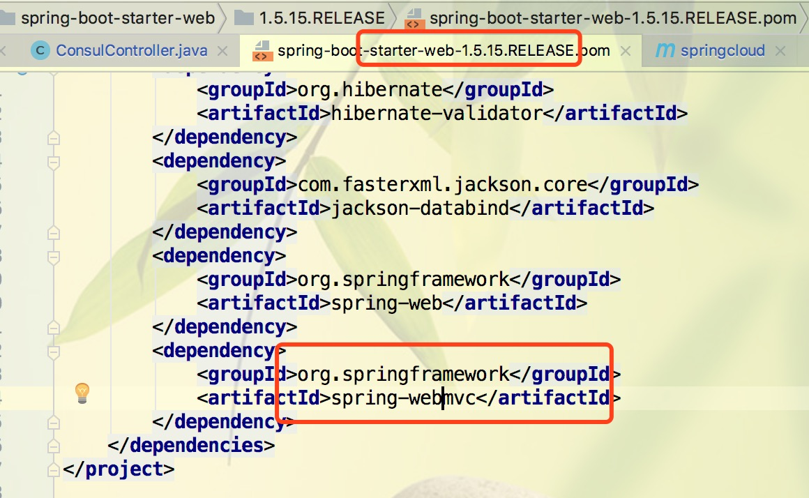

# SpringCloud
**题外话**：Spring 技术系列干货整理 [https://mp.weixin.qq.com/s/N507Cfb_mbkGvHtg_FIaVg](https://mp.weixin.qq.com/s/N507Cfb_mbkGvHtg_FIaVg)

若要将cloud升级为最新`Finchley`版，可以参考 [https://blog.csdn.net/youanyyou/article/details/81530240](https://blog.csdn.net/youanyyou/article/details/81530240)

	本demo已经尽力以JDK1.7为基础进行构建，但是由于官方要求JDK1.8，所以demo的部分模块必须使用JDK1.8运行，否则报错。
	官方要求使用jdk8，虽然spring boot在jdk7中也能运行，但是这里和spring cloud集成的时候就出问题了，问题表现为在maven build的时候出现8194错误代码。
	
####升级记录
|时间|内容|
|---|---|
|2018-8-28|已经升级为jdk1.8版本支持，不再支持1.7版本。|
|2018-9-7|升级完成，解决eureka-consumer启动报错问题|
	
本教程参考资料：[http://blog.didispace.com/Spring-Cloud基础教程/](http://blog.didispace.com/Spring-Cloud基础教程/)

GitHub地址：[https://github.com/dyc87112/SpringCloud-Learning.git](https://github.com/dyc87112/SpringCloud-Learning.git)

社区信息：[spring for all 社区](http://www.spring4all.com/)

cloud源码地址：[https://github.com/spring-cloud](https://github.com/spring-cloud)

**学习位置**  
1. [链接地址](http://blog.didispace.com/spring-cloud-starter-dalston-3-2/)


### Spring Cloud与Spring Boot版本匹配关系
Dalston版相关描述：[https://blog.csdn.net/ljj_9/article/details/78645267](https://blog.csdn.net/ljj_9/article/details/78645267)

**参考表格如下：**

|Cloud代号|Boot版本(train)|Boot版本(tested)|lifecycle|
|---|---|---|---|
|Angle  |1.2.x  |incompatible with 1.3  |EOL in July 2017|
|Brixton  |1.3.x  |1.4.x  |2017-07卒|
|Camden  |1.4.x  |1.5.x  |-|
|Dalston  |1.5.x  |not expected 2.x  |-|
|Edgware  |1.5.x  |not expected 2.x  |-|
|Finchley  |2.x  |not expected 1.5.x  |-|


|Spring Cloud     |              Spring Boot                    |
|---              |                ---                          |
|Finchley         |兼容Spring Boot 2.0.x，不兼容Spring Boot 1.5.x |
|Dalston和Edgware |兼容Spring Boot 1.5.x，不兼容Spring Boot 2.0.x |
|Camden           |兼容Spring Boot 1.4.x，也兼容Spring Boot 1.5.x|
|Brixton          |兼容Spring Boot 1.3.x，也兼容Spring Boot 1.4.x|
|Angel            |兼容Spring Boot 1.2.x                        |

Dalston.SR1对应JDK1.8。版本查找方式再pom文件中进行。

```xml
<dependency>
    <groupId>org.springframework.cloud</groupId>
    <artifactId>spring-cloud-dependencies</artifactId>
    <version>Dalston.SR1</version><!--Dalston.SR1-->
    <!--<type>pom</type>-->
    <!--<scope>import</scope>-->
</dependency>
            
            
<!--点击Dalston.SR1 ,在父pom中得到-->

 <parent>
		<groupId>org.springframework.cloud</groupId>
		<artifactId>spring-cloud-dependencies-parent</artifactId>
		<version>1.3.2.RELEASE</version>
		<relativePath/>
	</parent>
	
<!--继续点击1.3.2.REALEASE，进入父pom，得到-->
	
	<scm>
		<url>https://github.com/spring-cloud/spring-cloud-build</url>
		<connection>scm:git:git://github.com/spring-cloud/spring-cloud-build.git</connection>
		<developerConnection>scm:git:ssh://git@github.com/spring-cloud/spring-cloud-build.git</developerConnection>
		<tag>HEAD</tag>
	</scm>
	
	打开<url>标签的地址，看到java.version=1.8
```
###springcloud版本说明
说说Spring Cloud版本的那些事儿。

<font color=blue>springBoot 2.0版本已不再支持JDK1.7，需要将jdk版本升级为1.8方可正常使用。</font>


版本命名
之前提到过，Spring Cloud是一个拥有诸多子项目的大型综合项目，原则上其子项目也都维护着自己的发布版本号。那么每一个Spring Cloud的版本都会包含不同的子项目版本，为了要管理每个版本的子项目清单，避免版本名与子项目的发布号混淆，所以没有采用版本号的方式，而是通过命名的方式。

这些版本名字采用了伦敦地铁站的名字，根据字母表的顺序来对应版本时间顺序，比如：最早的Release版本：Angel，第二个Release版本：Brixton，以此类推……

版本号
经过上面的解释，不难猜出，之前所提到的Angel.SR6，Brixton.SR5中的SR6、SR5就是版本号了。

当一个版本的Spring Cloud项目的发布内容积累到临界点或者一个严重bug解决可用后，就会发布一个“service releases”版本，简称SRX版本，其中X是一个递增数字。

当前版本
通过下表，我们可以快速查阅当前各版本所包含的子项目，以及各子项目的版本号，通过此来决定需要选择怎么样的版本。

|Component|Angel.SR6|Brixton.SR5|Camden.M1|Camden.BUILD-SNAPSHOT|
|---|---|---|---|---|---|
|spring-cloud-aws|1.0.4.RELEASE|1.1.1.RELEASE|1.1.1.RELEASE|1.1.2.BUILD-SNAPSHOT|
|spring-cloud-bus|1.0.3.RELEASE|1.1.1.RELEASE|1.2.0.M1|1.2.0.BUILD-SNAPSHOT|
|spring-cloud-cli|1.0.6.RELEASE|1.1.5.RELEASE|1.2.0.M1|1.2.0.BUILD-SNAPSHOT|
|spring-cloud-commons|1.0.5.RELEASE|1.1.1.RELEASE|1.1.1.RELEASE|1.1.2.BUILD-SNAPSHOT|
|spring-cloud-contract|&nbsp;|&nbsp;|1.0.0.M2|1.0.0.BUILD-SNAPSHOT|
|spring-cloud-config|1.0.4.RELEASE|1.1.3.RELEASE|1.2.0.M1|1.2.0.BUILD-SNAPSHOT|
|spring-cloud-netflix|1.0.7.RELEASE|1.1.5.RELEASE|1.2.0.M1|1.2.0.BUILD-SNAPSHOT|
|spring-cloud-security|1.0.3.RELEASE|1.1.2.RELEASE|1.1.2.RELEASE|1.1.3.BUILD-SNAPSHOT|
|spring-cloud-starters|1.0.6.RELEASE|&nbsp;|&nbsp;|&nbsp;|
|spring-cloud-cloudfoundry|&nbsp;|1.0.0.RELEASE|1.0.0.RELEASE|1.0.1.BUILD-SNAPSHOT|
|spring-cloud-cluster|&nbsp;|1.0.1.RELEASE|&nbsp;|&nbsp;|
|spring-cloud-consul|&nbsp;|1.0.2.RELEASE|1.1.0.M1|1.1.0.BUILD-SNAPSHOT|
|spring-cloud-sleuth|&nbsp;|1.0.6.RELEASE|1.0.6.RELEASE|1.0.7.BUILD-SNAPSHOT|
|spring-cloud-stream|&nbsp;|1.0.2.RELEASE|Brooklyn.M1|Brooklyn.BUILD-SNAPSHOT|
|spring-cloud-zookeeper|&nbsp;|1.0.2.RELEASE|1.0.2.RELEASE|1.0.3.BUILD-SNAPSHOT|
|spring-boot|1.2.8.RELEASE|1.3.7.RELEASE|1.4.0.RELEASE|1.4.0.RELEASE|
|spring-cloud-task|&nbsp;|1.0.2.RELEASE|1.0.2.RELEASE|1.0.3.BUILD-SNAPSHOT|

不难看出，最初的Angel版本相对来说拥有的子项目较少，Brixton、Camden则拥有更全的子项目，所以能提供更多的组件支持。而Brixton与Camden之间，Brixton的发布子项目更为稳定，Camden则更为前瞻。

我在开始编写Spring Cloud系列博文时，刚好是Brixton的第一个RELEASE版本，所以果断采用了这个版本来作为样例基础。也可以看到，在这短短的几个月时间里，没有更新多少文章，但是其版本提升尽如此迅速，更加证明了该项目良好的发展势头。所以，何不现在就加入我们一起学习和实践这个将来也许会占领企业微服务架构的强大框架呢？


###eureka部分
在eureka-server中配置访问地址，[http://localhost:1111](http://localhost:1111)。  
先启动eureka-server,然后启动eureka-client。通过http://localhost:2111/hello，访问对应的controller信息。

**注意：如果配置的HTTP接口路径有相同的，则无法正常启动client。**
####eureka-client单元测试

参见`EurekaClientForJunitControllerTest`类，搭建过程如下：

 * 创建单元测试类(本例创建了基础类以及测试类)
 * 在测试类中添加单元测试相关的注解内容
 
 ```java
 //cloud单元测试基础配置注解，新版使用SpringRunner.class，替代SpringJUnit4ClassRunner.class
 @RunWith(SpringRunner.class)
 //该注解用来声明加载的ApplicationContext是一个WebApplicationContext
 @WebAppConfiguration
 //由于cloud是微服务方式启动，所以需要加上 EurekaClientApplication.class
 //类进行服务启动，测试时可以访问相应的HTTP接口
 @SpringBootTest(classes = {EurekaClientApplication.class,EurekaClientControllerTest.class})
 ```
 * 接下来添加HTTP相关类的内容，并添加单元测试方法，进行测试。完整内容如下
 
 ```java
 @RunWith(SpringRunner.class)
	//@WebAppConfiguration//1 该注解用来声明加载的ApplicationContext是一个WebApplicationContext。
	//@ContextConfiguration
	//@WebAppConfiguration("src/main/resources")//1 该注解用来声明加载的ApplicationContext是一个WebApplicationContext。
	public class AppJunitConfig {
	    protected MockMvc mockMvc;//2 模拟MVC对象，通过MockMvcBuilders.webAppContextSetup(this.wac).build()初始化
	
	    @Autowired
	    WebApplicationContext wac;//4 注入WebApplicationContext
	
	//    @Autowired
	//    MockHttpSession session;//5 注入可模拟的HTTPSession，此处仅用作演示
	//    @Autowired
	//    MockHttpServletRequest request;//6 可注入模拟的http Request，没有使用
	
	    @Before
	    public void setUp() {
	        //2 MockMvc-模拟MVC对象，通过MockMvcBuilders.webAppContextSetup（ this.wac）.build（）初始化。
	        this.mockMvc = MockMvcBuilders.webAppContextSetup(this.wac).build();
	    }
	}
 ```
 ```java
 
	@SpringBootTest(classes = {EurekaClientApplication.class,EurekaClientForJunitControllerTest.class})
	public class EurekaClientForJunitControllerTest extends AppJunitConfig {
	
	    @Test
	    public void testHello() throws Exception {
	        RequestBuilder request = get("/hello");
	        mockMvc.perform(request)
	                .andExpect(status().isOk())
	                .andExpect(content().string("Hello world"));
	    }
	}

 ```
 * 其他带参数类型的单元测试参见`EurekaClientForJunitControllerTest.java`类操作即可。


#### **注意：**

**谷歌浏览器mac版会发起两次请求，其他浏览器会正常的发起一次请求，原因尚不清楚。**

springcloud中client的application路径配置需要注意,如果需要使用默认路径，java类路径为xx.xxx.application.java  。参考资料：[http://blog.csdn.net/u014788227/article/details/53670112](http://blog.csdn.net/u014788227/article/details/53670112)


官网资料地址：[`https://springcloud.cc/spring-cloud-brixton.html#_quick_start`](https://springcloud.cc/spring-cloud-brixton.html#_quick_start)

spring-cloud-consul 资料地址：[https://springcloud.cc/spring-cloud-consul.html](https://springcloud.cc/spring-cloud-consul.html)

###consul部分

#####1. consul配置
在consul-client的pom里面，dependencies部分添加

```xml
<!--选用的版本不可以太高。2.0.x基于JDK1.8开发，如果使用JDK1.7编译会报错-->
<dependency>
    <groupId>org.springframework.boot</groupId>
    <artifactId>spring-boot-starter-parent</artifactId>
    <version>1.5.10.RELEASE</version>
    <type>pom</type>
</dependency>
```
其他部分按照教程即可。

启动consul命令

```
consul agent -dev
```
  
注意：如果application.java的路径高于三层包路径，则需要指定基础包范围，即服务的发现路径。`@ComponentScan(basePackages = "com.springcloud.eureka.client.consul")`或者在SpringBootApplication 注解上添加如下内容：`@SpringBootApplication(scanBasePackages = "com.springcloud.eureka.client")`

consul版本不要选太高，否则可能导致服务无法正常，本demo使用0.9.0版本。  
#####2. 下载地址：  
Linux-64：[`https://releases.hashicorp.com/consul/0.9.0/consul_0.9.0_linux_amd64.zip`](https://releases.hashicorp.com/consul/0.9.0/consul_0.9.0_linux_amd64.zip)  
mac-64：[`https://releases.hashicorp.com/consul/0.9.0/consul_0.9.0_darwin_amd64.zip`](https://releases.hashicorp.com/consul/0.9.0/consul_0.9.0_darwin_amd64.zip)  
windows-64：[`https://releases.hashicorp.com/consul/0.9.0/consul_0.9.0_windows_amd64.zip`](https://releases.hashicorp.com/consul/0.9.0/consul_0.9.0_windows_amd64.zip)


#####3. 基于consul分布式锁实现[demo尚不可用]
[http://blog.didispace.com/spring-cloud-consul-lock-and-semphore/](http://blog.didispace.com/spring-cloud-consul-lock-and-semphore/)
##### 4. 基于Consul的分布式信号量实现
[http://blog.didispace.com/spring-cloud-consul-lock-and-semphore-2/](http://blog.didispace.com/spring-cloud-consul-lock-and-semphore-2/)

###Spring Cloud构建微服务架构：服务消费（Ribbon）【Dalston版】

通过上一篇[《Spring Cloud构建微服务架构：服务消费（基础）》](http://blog.didispace.com/spring-cloud-starter-dalston-2-1/)，我们已经学会如何通过LoadBalancerClient接口来获取某个服务的具体实例，并根据实例信息来发起服务接口消费请求。但是这样的做法需要我们手工的去编写服务选取、链接拼接等繁琐的工作，对于开发人员来说非常的不友好。所以，下来我们看看Spring Cloud中针对客户端负载均衡的工具包：Spring Cloud Ribbon。

ribbon服务的controller类中，我们除了去掉了原来与LoadBalancerClient相关的逻辑之外，对于RestTemplate的使用，我们的第一个url参数有一些特别。这里请求的host位置并没有使用一个具体的IP地址和端口的形式，而是采用了服务名的方式组成。那么这样的请求为什么可以调用成功呢？因为Spring Cloud Ribbon有一个拦截器，它能够在这里进行实际调用的时候，自动的去选取服务实例，并将实际要请求的IP地址和端口替换这里的服务名，从而完成服务接口的调用。

###Spring Cloud Feign

Spring Cloud Feign是一套基于Netflix Feign实现的声明式服务调用客户端。它使得编写Web服务客户端变得更加简单。我们只需要通过创建接口并用注解来配置它既可完成对Web服务接口的绑定。它具备可插拔的注解支持，包括Feign注解、JAX-RS注解。它也支持可插拔的编码器和解码器。Spring Cloud Feign还扩展了对Spring MVC注解的支持，同时还整合了Ribbon和Eureka来提供均衡负载的HTTP客户端实现。


`EurekaConsumerFeignApplication`类添加`@EnableFeignClients`**【开启扫描Spring Cloud Feign客户端的功能】**注解之后，如果类路径不在三层包之内，则需要指定包路径，在该注解上添加`basePackages`参数的路径信息，同时`@ComponentScan`的参数不动。

 说明：  
 
 * `@EnableFeignClients`如果没有添加路径参数，则启动时报接口无法正常实例化异常，并启动失败。
 * `@EnableFeignClients`添加了参数路径设置，如果`@ComponentScan`没有指定应用的发现路径，则服务启动后，无法正常进行调用。会提示500错误。

 
###Spring Cloud Feign的文件上传实现

在Spring Cloud封装的Feign中并不直接支持传文件，但可以通过引入Feign的扩展包来实现，本来就来具体说说如何实现。

```xml
<dependency>
    <groupId>org.projectlombok</groupId>
    <artifactId>lombok</artifactId>
    <version>1.16.20</version>
    <scope>provided</scope>
</dependency>
        
        
        
 @SneakyThrows
这个注解用在方法上，可以将方法中的代码用try-catch语句包裹起来，捕获异常并在catch中用Lombok.sneakyThrow(e)把异常抛出，可以使用@SneakyThrows(Exception.class)的形式指定抛出哪种异常，很简单的注解，直接看个例子：

public class SneakyThrows implements Runnable {
    @SneakyThrows(UnsupportedEncodingException.class)
    public String utf8ToString(byte[] bytes) {
        return new String(bytes, "UTF-8");
    }

    @SneakyThrows
    public void run() {
        throw new Throwable();
    }
}

实际效果相当于：

public class SneakyThrows implements Runnable {
    @SneakyThrows(UnsupportedEncodingException.class)
    public String utf8ToString(byte[] bytes) {
        try{
            return new String(bytes, "UTF-8");
        }catch(UnsupportedEncodingException uee){
            throw Lombok.sneakyThrow(uee);
        }
    }

    @SneakyThrows
    public void run() {
        try{
            throw new Throwable();
        }catch(Throwable t){
            throw Lombok.sneakyThrow(t);
        }
    }
}
```

<font color=red><B>注意：</B></font>  
单元测试的java类路径必须与application.java类的路径相同，否则无法正常实例化接口进行调用。本示例中，`eureka-feign-upload-client`模块，application位置在`com.springcloud.feign.upload.client.app`包下，则单元测试的位置也需要在Test中对应的包下进行创建。否则提示接口无法实例化。原因尚不清楚。

### 分布式配置中心

 ```
 Spring Cloud Config是Spring Cloud团队创建的一个全新项目，用来为分布式系统中的基础设施和微服务应用提供集中化的外部配置支持，它分为服务端与客户端两个部分。其中服务端也称为分布式配置中心，它是一个独立的微服务应用，用来连接配置仓库并为客户端提供获取配置信息、加密/解密信息等访问接口；而客户端则是微服务架构中的各个微服务应用或基础设施，它们通过指定的配置中心来管理应用资源与业务相关的配置内容，并在启动的时候从配置中心获取和加载配置信息。Spring Cloud Config实现了对服务端和客户端中环境变量和属性配置的抽象映射，所以它除了适用于Spring构建的应用程序之外，也可以在任何其他语言运行的应用程序中使用。由于Spring Cloud Config实现的配置中心默认采用Git来存储配置信息，所以使用Spring Cloud Config构建的配置服务器，天然就支持对微服务应用配置信息的版本管理，并且可以通过Git客户端工具来方便的管理和访问配置内容。当然它也提供了对其他存储方式的支持，比如：SVN仓库、本地化文件系统。

在本文中，我们将学习如何构建一个基于Git存储的分布式配置中心，并对客户端进行改造，并让其能够从配置中心获取配置信息并绑定到代码中的整个过程。
 ```

 **项目模块**：springcloud-config-repo-demo(配置仓库名称),config-client(配置中心的应用名称),config-server-git(配置中心)
 
 配置仓库地址：[https://github.com/os-technology/springcloud-config-repo-demo](https://github.com/os-technology/springcloud-config-repo-demo)。配置仓库如果在其他项目的子模块等位置创建，仓库地址不变，需要指定搜索的目录，配置参考如下：
 
  ```properties
  
  #仓库地址
  spring.cloud.config.server.git.uri=https://github.com/os-technology/books/
  #搜索仓库中指定目录下的配置信息
  spring.cloud.config.server.git.search-paths=springcloud/config-cloud-repo
  ```
 <font color=blue>注意：仓库地址不可直接输入完整uri，否则不生效。本例配置信息完整地址为：
  https://github.com/os-technology/books/tree/master/springcloud/config-cloud-repo，**这是错误的**。</font>
  
 该部分目前只能使用JDK1.8进行正常启动。操作方式如下：
 
**config-servier-git模块操作**
 
 ```
 访问配置信息的URL与配置文件的映射关系如下：

/{application}/{profile}[/{label}]
/{application}-{profile}.yml
/{label}/{application}-{profile}.yml
/{application}-{profile}.properties
/{label}/{application}-{profile}.properties
 ```
 启动config-server-git模块，然后输入 [http://localhost:2119/config-client/default/master](http://localhost:2119/config-client/default/master)得到如下结果：
 

 
 ```json
 {
name: "config-client",
profiles: - [
"default"
],
label: "master",
version: null,
state: null,
propertySources: - [
- {
name: "https://github.com/os-technology/springcloud-config-repo-demo/config-client.yml",
source: - {
info.profile: "default",
info.from: "git"
}
}
]
}
 ```
 
 说明：URL中的default部分，可以替换成dev,master部分，代表所用仓库的分支名称。访问时会得到对应的json信息。
 
 **config-client模块**  
 
 在微服务应用中获取上述的配置信息。  
 
 **该模块(config-client)这里需要格外注意：上面这些属性必须配置在bootstrap.properties中，这样config-server中的配置信息才能被正确加载。**
 
 pom.xml配置中，必须要再次添加如下依赖方可正常访问。否则访问`http://localhost:2120/info`提示404异常。
 
 ```
 <dependencyManagement>
        <dependencies>
            <dependency>
                <groupId>org.springframework.cloud</groupId>
                <artifactId>spring-cloud-dependencies</artifactId>
                <version>Dalston.SR1</version>
                <type>pom</type>
                <scope>import</scope>
            </dependency>
        </dependencies>
    </dependencyManagement>
 ```
 
 在完成了上面你的代码编写之后，读者可以将config-server-git、config-client都启动起来，然后访问 [http://localhost:2120/info](http://localhost:2120/info) 

### 服务打包发布

pom文件中添加了`org.springframework.boot:spring-boot-maven-plugin`插件。在添加了该插件之后，当运行`mvn package`进行打包时，会打包成一个可以直接运行的 JAR 文件，使用“java -jar”命令就可以直接运行。

可以在POM中，指定生成 的是Jar还是War `<packaging>jar</packaging>` 默认为jar

你还可以指定要执行的类，如果不指定的话，Spring会找有这个`public static void main(String[] args)`方法的类，当做可执行的类。当出现两个类含有main方法时，会报错。

可以通过以下两个方法来指定启动类：

第一种：如果你的POM是继承`spring-boot-starter-parent`的话，只需要下面的指定就行

 ```xml
    <properties>    
        <!-- The main class to start by executing java -jar -->    
        <start-class>com.xx.xx</start-class>
    </properties>
 ```
 
 第二种：如果你的POM不是继承`spring-boot-starter-parent`的话，需要下面的指定
 
  ```xml
  <build>  
      	<plugins>  
              <plugin>
                  <groupId>org.springframework.boot</groupId>
                  <artifactId>spring-boot-maven-plugin</artifactId>
                  <version>1.3.5.RELEASE</version>
                  <configuration>
                      <mainClass>com.xx.xx</mainClass>
                  </configuration>
                  <executions>
                      <execution>
                        <goals>
                          <goal>repackage</goal>
                        </goals>
                      </execution>
                  </executions>
              </plugin>
      	</plugins>  
  </build> 
  ```
打包如果没有将配置文件加载进去或者有些系统，关于一些数据库或其它第三方账户等信息，由于安全问题，其配置并不会提前配置在项目中暴露给开发者。对于这样的情况，我们在运行程序的时候。能够通过參数指定一个外部配置文件。

`java -jar xx.jar --spring.config.location=application.properties`

### 分布式配置中心（加密解密）

`TODO`

### FAQ整理

##### <font color=blue><B>上传文件部分的问题</B></font>

* 单元测试的java类路径必须与application.java类的路径相同，否则无法正常实例化接口进行调用。本示例中，`eureka-feign-upload-client`模块，application位置在`com.springcloud.feign.upload.client.app`包下，则单元测试的位置也需要在Test中对应的包下进行创建。否则提示接口无法实例化。原因尚不清楚。
* 如果运行本demo出现以下异常，

 ```java
 //异常信息
 java.lang.IllegalStateException: Could not load TestContextBootstrapper [null]. Specify @BootstrapWith's 'value' attribute or make the default bootstrapper class available.
 
 ```

 请检查`spring-webmvc`和 `spring-test`版本是否差距较大。本demo使用依赖如下：


 ```xml
 <!--测试发现spring-test版本在4.3.16-4.3.18都可以正常操作，其他版本未实验-->
 <dependency>
    <groupId>org.springframework</groupId>
    <artifactId>spring-test</artifactId>
    <version>4.3.18.RELEASE</version>
 </dependency>
 
 ```
   
 根据`starter-web`版本，到spring-boot源码中，找到对应的版本(源码版本只有`1.5.14.RELEASE`的tag)，发现`spring-webmvc`为`4.3.18.RELEASE`,则需要将test版本改为对应版本即可。


##### <font color=blue>___2018-9-7___ 解决eureka-consumer启动报错问题，并更新application类的web方法赋值方式</font>
 
* **解决方案**：原有基础上添加以下依赖即可
 
  ```xml
  <dependency>
    <groupId>org.springframework.cloud</groupId>
    <artifactId>spring-cloud-starter-netflix-eureka-client</artifactId>
  </dependency>
  ```
  
